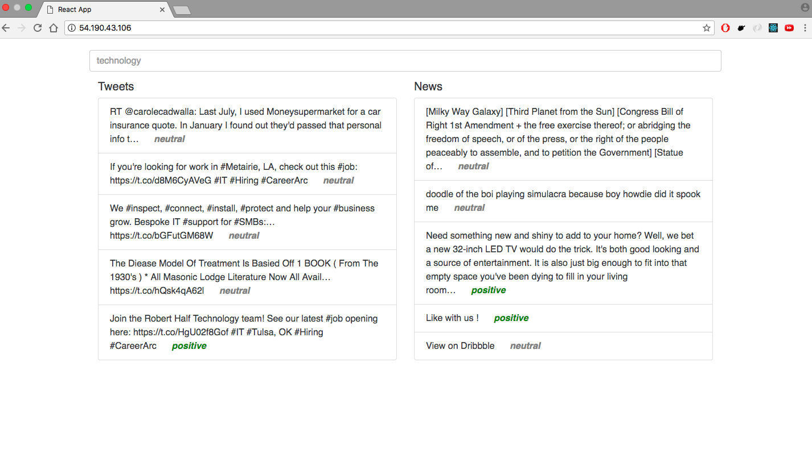

## [Assignment Task 1](https://github.com/Saurabh3012/Application-task/tree/master/data#data-collection)

## [Assignment Task 2](https://github.com/Saurabh3012/Application-task/tree/master/analysis#analysis)

## Application Task 3

### Pre-requisites:

   - Steps to be followed form [Task #1](https://github.com/Saurabh3012/Application-task/tree/master/data#data-collection)

1. Set up a web application on Heroku or Digital Ocean Droplet with a user interface where we can input a named-entity and get the comparison between the news and twitter sentiments as an output.
    
   - The application is a nodejs, expressjs api that handles the data and sends it to the front end in JSON format. API fetches real time tweets using [Twitter Search Api](https://developer.twitter.com/en/docs/tweets/search/overview) and the [News Everything API](https://newsapi.org/docs/endpoints/everything). For sentiment analysis, [Aylien's Sentiment Ananlysis](https://docs.aylien.com/textapi/endpoints/#sentiment-analysis) api is used. 
   - The front end is written in React and present in the front-end directory. I have used the create-react-app package to start with boilerplate code.
        
    API doc:
    
    | Verb  | Route            | Description                                               |
    | :---: |:----------------:| :--------------------------------------------------------:|
    | POST  | /tweet/:keyword  | to fetch top 5 tweets and return their sentiments.        |
    | POST  | /news/:keyword   | to fetch top 5 news articles and return their sentiments. |
    
    Front End Snapshots:
    
    By default it shows result based on the keyword: "technology"
    
    
    The result changes when you enter a keyword: "politics"
         

##### Deployments
- The api and front end are deployed on different servers and data is transferred/received using AJAX requests.
- API - is served using bin/www and pm2 for monitoring and logging.
- Front End - a production build of react is served using nginx server.
 
2. Put all your code, along with the MongoDB collection, in a GitHub repository and share the link with us. Also, maintain a README.md explaining your codebase and the approach you followed. 

 
#### Help links:
 - [Stack Overflow](https://stackoverflow.com)
 - [The Python Graph Gallery](https://python-graph-gallery.com)
 - [Mongodb Documentation](https://docs.mongodb.com)
 - [Mongoose ODM](http://mongoosejs.com/)
 - [Pymongo Documentation](https://api.mongodb.com/python/current/)

 
