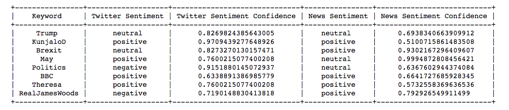
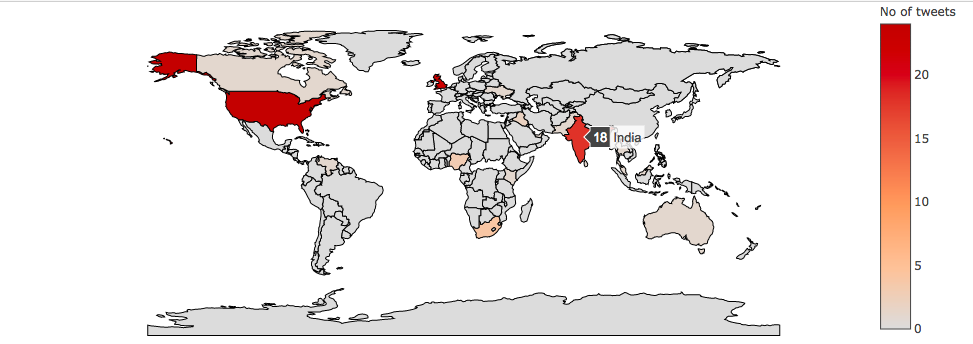

## Analysis

### Pre-requisites:

   - Steps to be followed form [Task #1](https://github.com/Saurabh3012/Application-task/tree/master/data#data-collection)

### Note:
```diff
- Since, I am a free user for the api, there is a limit to [Aylien](https://aylien.com) api usage- Only 1000 requests available in one day. So, if the system doesn't work, this might be the primary reason.
```    

```diff
+ Everything for this section can be viewed on the Jupyter notebooks hosted [here](http://34.214.41.107:8888/). Send a mail to saurabhgupta3012@gmail.com to request access.
```

1. Perform a Sentiment Analysis on the data collected in Step 1 and 3, and compare the twitter and news sentiments for the common named-entities. 

   - Create an index on "text" field in tweets collection. This is to ensure searching tweets based on the keyword. Run the following in a mongo shell (using Studio 3T or softwares similar to that or directly from the server)
   ```shell
    db.tweets.createIndex({ text: "text" })
   ```
   - Run data/analysis.js with node - For each keyword, fetch top 20 tweets based on search relevancy score and all the 20 news articles to create a document of tweets/news for each keyword.
    Use [Aylien](https://aylien.com) api in document mode for sentiment analysis of created docs. Write the data back to mongodb (Sentiment Collection in data/db_collections).

   - Open [Jupyter Notebooks](http://34.214.41.107:8888/) to view the results.
   
   
    
2. You should also perform temporal, spatial and content analysis on the collected data, to answer questions such as Who posted the data, What was it about, When was it posted, from Where was it posted etc.
   
   - [x] What was it about? - A wordcloud formed using news and twitter data. 
   
    - Twitter Wordcloud 
    
   
    - News Wordcloud
    
    
   - [x] Where was it posted?
   
    - Tweets
    
    
   - [x] When was it posted?
    
    - Tweets
    
    
    - News
    
        
   - [x] Who posted it?
   
    - News
    
    
3. Report these results you found in the steps 5 & 6 using graphs. Brownie points for cool interactive visualisations.
